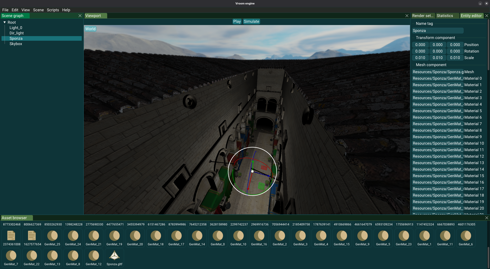

# Vroom

Vroom is a 3D game engine made with OpenGL. It is a personal project I'm doing to improve myself as a computer graphics and C++ developer.

## Mini demo video


[](https://www.youtube.com/watch?v=vl6pf3gR6Pc)


## Features

- Rendering
  - MSAA
  - Directional lights shadow mapping
    - TODO: cascaded shadow maps
  - Kernel-based soft shadows
  - Normal mapping
  - Clustered rendering for point lights
  - Modular shaders and materials
- Assets
  - Asset loader based on file path/name
  - Keeping track of (un)used asset for runtime memory management + caching
  - Mesh importer
- Inputs
  - Triggers, for callbacks on press/release-compatible events
  - Custom events, for callback on any events
- Scripting
  - Native C++ scripting
  - Reflexion on user scripts for scenes (de)serialization
- Editor
  - Assets browser + DragAndDrop from OS explorer
  - Scenes opening/saving
  - Meshes, materials DragAndDrop on mesh components
  - Entity picking

## Screenshots

Editor


## Building project

```bash
git clone git@github.com:Hypooxanthine/Vroom.git --recursive
```

- In repository root folder, open a terminal and type:
```bash
mkdir build
cd build
cmake ..
ctest # If you want to run unit tests
doxygen ../Doxyfile # If you need to generate documentation
cmake --build . --target=VroomEditor --config=Release --parallel
```

```bash
cd VroomEditor # Don't use ./VroomEditor/VroomEditor directly because the program won't be able to load resource files.
./VroomEditor
```
