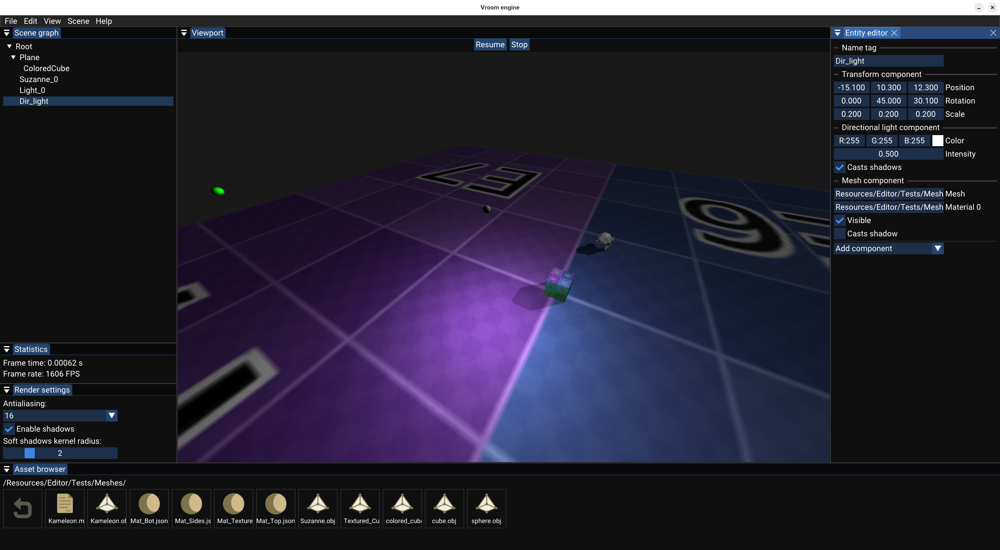

# Vroom

Vroom is a 3D game engine made with OpenGL. It is a personal project I'm doing to improve myself as a computer graphics and C++ developer.

## Screenshots

Editor


Light complexity per cluster (clustered rendering)


## Building project

### Windows

#### Visual Studio

In repository root folder, open a terminal and type :

```bash
mkdir build
cd build
cmake ..
ctest # If you want to run unit tests
doxygen ../Doxyfile # If you need to generate documentation
```

Now you can either open the Visual Studio solution, or build the editor directly from the terminal:

```bash
cmake --build . --target=VroomEditor --config=Release --parallel
```

#### VS Code

You can also build the project by opening the root folder on VS Code, and use the "CMake" and "CMake Tools" VS Code extensions (that is my workflow).

### Linux

> **_NOTE:_**  Vroom is actively developped for the Windows platform, but I try to keep it compatible with Linux as much as possible.

Install required dependencies:
```bash
sudo apt install libglfw3-dev
```

#### CMake/Make

- In repository root folder, open a terminal and type:
```bash
mkdir build
cd build
cmake ..
cmake --build . --target=VroomEditor --config=Release --parallel
```

- Launching Sandbox program:
```bash
cd VroomEditor # Don't use ./VroomEditor/VroomEditor directly because the program won't be able to load resource files.
./VroomEditor
```

#### VS Code

You can also build the project by opening the root folder on VS Code, and use the "CMake" and "CMake Tools" VS Code extensions. You might also need to install the [Ninja build system](https://github.com/ninja-build/ninja) if it is not already installed on your system:

```bash
sudo apt install ninja-build
```

## External libraries

- [glew](https://glew.sourceforge.net/)
- [glfw](https://www.glfw.org/)
- [glm](https://github.com/icaven/glm)
- [spdlog](https://github.com/gabime/spdlog)
- [stb](https://github.com/nothings/stb)
- [OBJ-Loader](https://github.com/Bly7/OBJ-Loader)
- [entt](https://github.com/skypjack/entt)

## Inspirations

- [Hazel](https://github.com/TheCherno/Hazel), game engine created by TheCherno.
- [Unreal Engine](https://www.unrealengine.com/)
- [javidx9 (YouTube)](https://www.youtube.com/channel/UC-yuWVUplUJZvieEligKBkA)

## Known problems

- Unbinding trigger and custom event inputs is buggy.
- On my Ubuntu system, mouse movement is not detected when the cursor input mode is set to GLFW_CURSOR_DISABLED.
